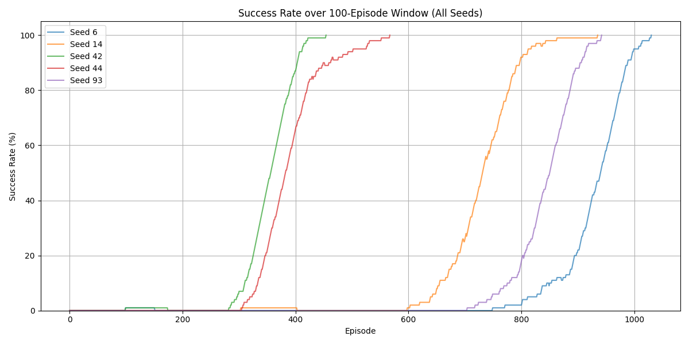

# SAC-HER Implementation for FetchReach Environment

This project implements a combination of Soft Actor-Critic (SAC) and Hindsight Experience Replay (HER) for robotic manipulation in the FetchReach environment. The implementation focuses on sample-efficient learning in sparse reward settings.

## Video Demo

### Watch the Training Process in Action!
[](https://youtu.be/pxpdP-3F_zA?si=DHxuSBMeCE9bt-gq)

Click the image above or [here](https://youtu.be/pxpdP-3F_zA?si=DHxuSBMeCE9bt-gq) to view the demo.

## Overview

### Soft Actor-Critic (SAC)

SAC is a state-of-the-art reinforcement learning algorithm designed for continuous control tasks. Key features include:

- Entropy regularization for balancing exploration and exploitation
- Clipped double Q-technique using two Q-functions to reduce overestimation bias
- Off-policy learning with experience replay for sample efficiency
- Proven success in both simulated environments and real-world robotics tasks

### Hindsight Experience Replay (HER)

HER is a technique specifically designed for sparse reward environments. It enhances learning by:

- Treating failures as successes for alternative goals
- Modifying replay buffers to include alternative goal states
- Significantly improving learning efficiency in sparse reward settings
- Being particularly effective in robotics applications

## Implementation Details

### Environment Setup

- Uses FetchReach environment from gymnasium_robotics with sparse rewards
- Ball position modified to [0, 0, 0] in reach.py due to reachability constraints
- Built with PyTorch for neural networks and MuJoCo for physics simulation

### Architecture

#### Soft Actor-Critic
- Implements double Q-learning with clipping trick
- Components:
  - Two Q-networks (critics) for target networks
  - One policy network (actor)
  - Automated entropy tuning

#### Neural Network Structure
- Target Networks:
  - Input: Concatenated state and action
  - Two hidden layers (256 units each) with ReLU activation
  - Output: Single Q-value prediction

- Policy Network:
  - Input: State
  - Two hidden layers (256 units each) with ReLU activation
  - Output: Mean and standard deviation of action distribution

### HER Replay Buffer

- Implements k-future strategy for goal relabeling
- Stores original experiences and creates additional experiences through goal relabeling

### Training Parameters

- Maximum episodes: 1000
- Episode length: 50
- Batch size: 256
- Random episodes: 256

## Running the Code

### Training
```bash
python3 scripts/traing_agent.py
```

### Experiments
```bash
python3 scripts/seed_experiment.py
```

## Experimental Setup

The implementation was tested with the following parameters:

- Random seeds: [6, 14, 42, 44, 93]
- Maximum episodes: 3000
- Episode length: 50
- Batch size: 256

### Experiment Process
1. Initialize environment and agent with given seed
2. Sample episodes and store in replay buffer
3. Update SAC agent when buffer size exceeds batch size
4. Track success rate (distance to goal < 0.05)
5. Halt training if 100% success rate achieved for last 100 episodes
6. Plot metrics for each seed and combined results

## Results Analysis

### Result Plots


### Performance Metrics
- All seeds achieved 100% success rate
- Initial 256 episodes showed zero success (exploration phase)
- Fastest seed (42): ~200 episodes to 100% success
- Slowest seed (6): ~750 episodes to 100% success

### Learning Characteristics
- Sigmoid-like learning curves across all seeds
- Rapid transition from near-zero to near-perfect performance
- Stable performance once high success rates achieved
- Consistent learning pattern but variable learning speed

### Variations Between Seeds
- Learning duration varied from 400 to 1000 episodes
- Potential factors affecting variation:
  - Initial random exploration phase
  - Fixed episode length
  - SAC temperature parameter settings
  - Batch size considerations

## References

1. OpenAI, "Soft Actor-Critic (SAC)," Spinning Up in Deep Reinforcement Learning, Oct. 2018
2. Haarnoja et al., "Soft Actor-Critic: Off-Policy Maximum Entropy Deep Reinforcement Learning with a Stochastic Actor," ICML 2018
3. Andrychowicz et al., "Hindsight Experience Replay," NeurIPS 2017
4. Yarats, pytorch_sac implementation
5. Dai, hindsight-experience-replay implementation
